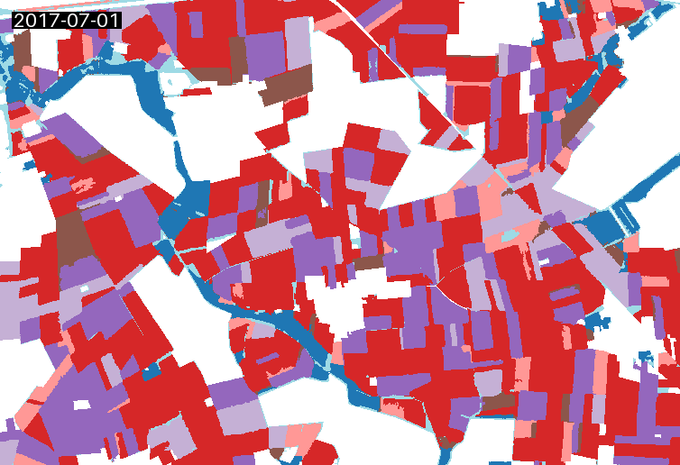

# Thünen Earth Observation (ThEO) STAC Demo

<p align="center">
   
</p>

This project demonstrates how to work with STAC (SpatioTemporal Asset Catalog) data by retrieving crop type maps from the [ThEO STAC API](https://eodata.thuenen.de), processing the data, and generating an animated GIF. The project uses Python along with libraries such as `pystac_client`, `stackstac`, and `geogif`.

## Table of Contents

- [Overview](#overview)
- [Environment Setup](#environment-setup)
  - [Using Conda](#using-conda)
  - [Using Micromamba](#using-micromamba)
- [Running the Code](#running-the-code)
- [Interactive Notebook](#interactive-notebook)
- [License](#license)

## Overview

This repository is aimed at demonstrating how to work with remote sensing data using the [ThEO STAC API](https://eodata.thuenen.de). The primary goal is to show how spatial data can be accessed, processed, and visualized effectively. In particular, the script located in `src/stac_demo.py` retrieves crop type maps from the [ThEO STAC API](https://eodata.thuenen.de) for a defined geographic area and time range, stacks the data into a mosaic using `stackstac`, and generates an animated GIF using `geogif`. This visual representation helps illustrate temporal variations in crop types.

The script located in `src/stac_demo.py` connects to a STAC API, stacks and processes the resulting data, and eventually produces an animated GIF stored in the `output` directory.

## Environment Setup

An `environment.yml` file is provided to help you create the necessary environment with all required dependencies. You can create the environment using either Conda or Micromamba.

### Using Conda

1. Make sure you have [Conda](https://docs.conda.io/projects/conda/en/latest/user-guide/install/) installed.
2. Create the environment by running:

   ```bash
   conda env create -f environment.yml
   ```

3. Activate the environment:

   ```bash
   conda activate theo-stac-demo
   ```

### Using Micromamba

1. Ensure you have [Micromamba](https://mamba.readthedocs.io/en/latest/installation.html) installed.
2. Create the environment by running:

   ```bash
   micromamba create --file environment.yml
   ```

3. Activate the environment:

   ```bash
   micromamba activate theo-stac-demo
   ```

## Running the Code

After activating the environment, you can run the source code using the following command:

```bash
python src/stac_demo.py
```

The script will connect to the STAC API, process the crop type data, and generate an animated GIF saved in the `output` folder.

## Interactive Notebook

For interactive exploration, you can use the provided Jupyter notebook `src/stac_demo_notebook.ipynb`. This notebook allows you to step through the workflow, experiment with parameters, and visualize results interactively as an alternative to running the Python script.

## License

This project is licensed under the terms specified in the [LICENSE](LICENSE) file.